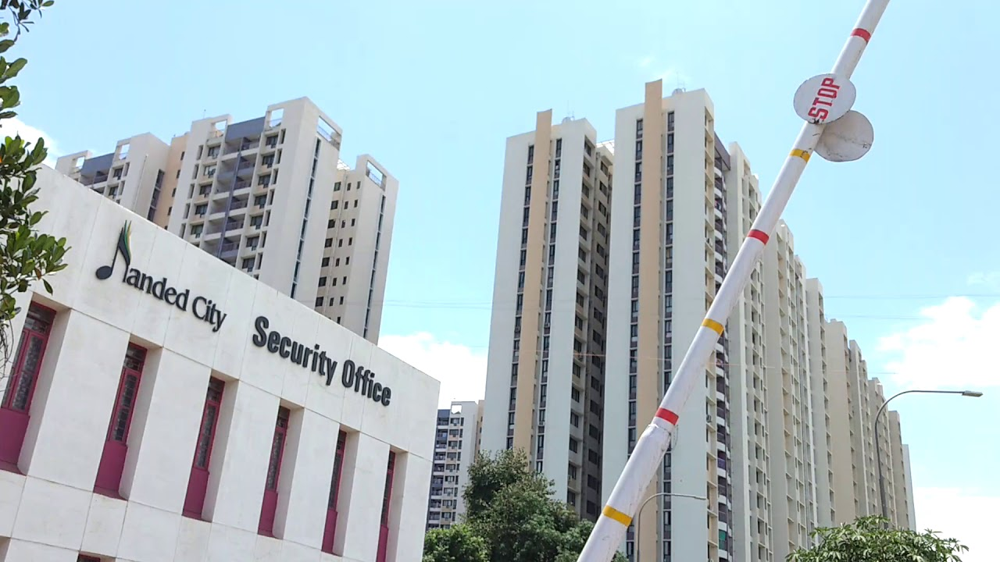

# Multimodal QA App

## Overview
This app allows users to upload an image or provide an image URL, ask a question about the image, and receive an answer generated by a Large Language Model (LLM) with vision capabilities.

---

## Screenshots

### 1. Upload Image & Ask Question

---

## LLM API Used
- **Google Gemini 1.5 Flash** (via `google-generativeai` Python SDK)

### Why Gemini 1.5 Flash?
- Supports both text and image (multimodal) inputs.
- Faster and more efficient than previous Gemini models.
- Delivers high-quality, context-aware answers for visual question answering tasks.
- Easy integration with Python and Flask for rapid prototyping.

---

## Sample Outputs / Test Report

| Image | Question | Model Answer |
|-------|----------|--------------|
|  | What animal is in this image? | That's a cat. More specifically, it appears to be a white cat with orange/ginger markings on its head and tail. It's a domestic shorthair. |
|  | What does this sign mean? | That's a **stop sign**. It's a universally recognized traffic control device that means drivers must come to a complete stop before proceeding. They must yield the right-of-way to any pedestrians or vehicles already in the intersection or approaching it. |
|  | Describe the scene. | Here is a description of the scene in the image: The photo shows a sunny day outside a security office in a high-rise apartment complex.  The foreground is dominated by a low, off-white security office building with the words "Handed City Security Office" prominently displayed. The building has several windows with maroon-colored frames. A portion of a tree is visible on the left. The background features multiple tall, light-colored apartment buildings. They are modern in style, with numerous stories and uniformly sized windows.  A large white and red striped security boom barrier extends diagonally across the scene, angled from the upper right corner towards the security office. A circular “STOP” sign is affixed to it.  The sky is mostly clear and blue, with only a few small clouds. Green trees are visible at the base of the apartment buildings. A streetlight is also visible on the right. |

---

## How to Run
1. Install dependencies: `pip install -r requirements.txt`
2. Run the app: `python main.py`
3. Open [http://localhost:4000](http://localhost:4000) in your browser.

---

## Notes
- Ensure you have a valid Gemini API key in `.env`.
- The app supports both file upload and image URL for flexible usage. 