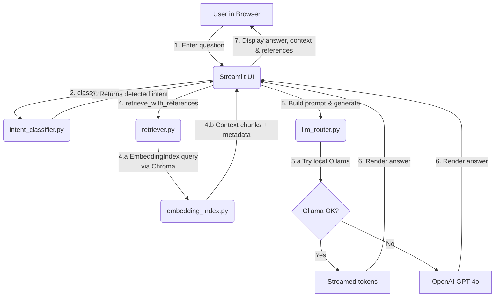

# Customer Support RAG – Architecture & Manual-Testing Guide

## 1. High-level Flow



*Numbers correspond to the order of operations in the code*.

## 2. Module Cheat-Sheet

| File | Responsibility |
|------|----------------|
| `ui/streamlit_app.py` | Streamlit front-end. Handles user input, orchestrates the pipeline, and renders results with source references. |
| `app/intent_classifier.py` | Few-shot LLM prompt that returns the intent (`technical`, `billing`, `feature_request`). |
| `app/retriever.py` | Splits KB documents into chunks and queries a Chroma vector index for the top-k relevant chunks. **Enhanced with source references**. |
| `app/embedding_index.py` | Thin wrapper around ChromaDB + Sentence-Transformers model (`paraphrase-multilingual-MiniLM`). **Enhanced to store and return metadata**. |
| `app/llm_router.py` | Sends final prompt to a local Ollama instance (Llama 3). On error/time-out, falls back to OpenAI Chat API. |
| `tests/…` | Unit & UI tests (pytest + Streamlit testing API). |

## 3. Source References Feature

The system now tracks and displays source references for each retrieved chunk:

### 3.1 What's Tracked
- **Source file**: Relative path from knowledge base root
- **File name**: Original filename
- **Chunk index**: Position of the chunk within the file
- **Intent category**: Which intent folder the file belongs to
- **Similarity score**: How relevant the chunk is to the query

### 3.2 API Changes
- `retrieve_with_references()` - Returns documents with metadata
- `retrieve()` - Legacy method (backward compatible)
- Enhanced UI checkbox to toggle reference display

### 3.3 Example Reference Output
```
Chunk 1: (Source: technical/password_reset.md, Chunk #2)
> To reset your password, go to the login page and click...
Similarity: 0.847
```

## 4. Manual Testing Walk-through

Below are concrete, copy-pasteable commands so you can validate the system end-to-end **without** the automated test-suite.

### 4.1 Setup environment

```bash
# 1. Create & activate a fresh virtualenv (optional)
python -m venv .venv && source .venv/bin/activate

# 2. Install dependencies
pip install -r requirements.txt

# 3. (Optional) Set env vars for OpenAI fallback
export OPENAI_API_KEY="sk-..."
#   Or tweak models / Ollama URL if needed
export OLLAMA_MODEL="llama3:8b"
```

### 4.2 Build Vector Index (only needed the **first** time)

```bash
python - <<'PY'
from app.retriever import build_index
build_index()
PY
```

You should see log lines like `Indexed 42 chunks for technical`.

### 4.3 Launch the Streamlit UI

```bash
streamlit run ui/streamlit_app.py
```

Open http://localhost:8501 – the page shows:

* Title **📚 Local RAG Customer Support Assistant**
* Sidebar with **LLM backend** selector & **Top-k context chunks** slider
* **New**: **Show source references** checkbox (enabled by default)

### 4.4 Example Interactive Session

1. Enter the prompt: `How do I reset my password?`
2. Observe the interim assistant message: `Detected intent: technical`
3. Expand **Retrieved context with references**; you should see:
   - Source file paths (e.g., `technical/password_reset.md`)
   - Chunk indices within each file
   - Similarity scores for each chunk
4. The assistant streams back an answer from Ollama/OpenAI.
5. Toggle **Show source references** off to see the legacy view without metadata.

### 4.5 CLI Smoke-Tests (no UI)

Test the new reference functionality:

```bash
python - <<'PY'
from app.retriever import retrieve_with_references
results = retrieve_with_references("password reset", intent="technical", k=2)
for result in results:
    print(f"Content: {result['content'][:50]}...")
    print(f"Source: {result['metadata']['source_file']}")
    print(f"Chunk: {result['metadata']['chunk_index']}")
    print(f"Similarity: {1 - result['distance']:.3f}")
    print("---")
PY
```

Test legacy compatibility:

```bash
python - <<'PY'
from app.retriever import retrieve
docs = retrieve("password reset", intent="technical", k=2)
print(f"Legacy method still works: {len(docs)} documents retrieved")
PY
```

### 4.6 Run Automated Tests

```bash
pytest -q      # Should now show 6 passed, 1 skipped
```

The new tests verify both the enhanced reference functionality and backward compatibility.

---

Happy debugging & experimenting! 🎉 