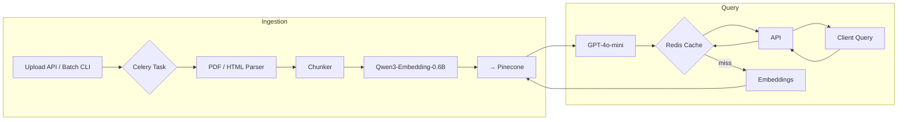

# Financial Intelligence RAG System

A production-ready Retrieval-Augmented Generation (RAG) platform that provides real-time insights from corporate financial documents. It combines a high-performance vector search (Pinecone) with OpenAI’s GPT-4o-mini for answer synthesis, Redis-backed caching, asynchronous FastAPI endpoints, and Celery-powered ingestion workers.

---

## Table of Contents
1. [Features](#features)
2. [Architecture](#architecture)
3. [Quick Start](#quick-start)
4. [Environment Variables](#environment-variables)
5. [Manual Testing Guide](#manual-testing-guide)
6. [Running the Test Suite](#running-the-test-suite)
7. [Project Layout](#project-layout)
8. [Roadmap](#roadmap)

---

## Features
* **Document Ingestion** – Celery tasks parse PDFs/HTML, chunk text, embed with `Qwen3-Embedding-0.6B` (sentence-transformers), and upsert to Pinecone.
* **Semantic Querying** – Encodes questions, retrieves top-K relevant chunks, and synthesises answers with GPT-4o-mini.
* **Intelligent Caching** – Redis keys (`query_result:{sha256}`) with TTLs for real-time (1 h) and historical (24 h) data.
* **Async FastAPI** – `/api/v1/*` endpoints with Prometheus metrics exposed at `/metrics`.
* **Monitoring** – Out-of-the-box Prometheus metrics; ready for Grafana dashboards.
* **Docker-Compose** – One-command spin-up of API, worker, and Redis.
* **Test Suite** – Pytest unit tests + sample integration tests (extensible).

---

## Architecture


---

## Quick Start
### 1. Prerequisites
* **Docker & Docker Compose** (v2+ recommended)
* Pinecone & OpenAI API keys

### 2. Clone & Configure
```bash
git clone <repo> financial-rag
cd financial-rag
cp .env.example .env  # edit with your keys
```
`./.env` (example):
```dotenv
PINECONE_API_KEY=your_pinecone_key
PINECONE_ENVIRONMENT=us-east1-gcp
OPENAI_API_KEY=your_openai_key
```

### 3. Build & Run
```bash
docker compose up --build
```
The stack launches:
* **api** – FastAPI on `http://localhost:8000`
* **worker** – Celery worker
* **redis** – Cache & broker

---

## Environment Variables
| Variable | Default | Description |
|----------|---------|-------------|
| `PINECONE_API_KEY` | – | Pinecone service key |
| `PINECONE_ENVIRONMENT` | `us-east1-gcp` | Cloud & region |
| `PINECONE_INDEX_NAME` | `financial-intel-index` | Vector index name |
| `OPENAI_API_KEY` | – | OpenAI key for GPT-4o-mini |
| `REDIS_BROKER_URL` | `redis://redis:6379/0` | Broker + cache URL |
| `TTL_REALTIME` | `3600` | TTL for real-time queries |
| `TTL_HISTORICAL` | `86400` | TTL for historical data |

---

## Manual Testing Guide
Below are cURL examples; any REST client (Postman, Insomnia, etc.) works.

### 1. Health Check
```bash
curl http://localhost:8000/api/v1/health
# → {"status":"ok"}
```

### 2. Upload a Document
```bash
curl -F "file=@/path/to/10K.pdf" \
     http://localhost:8000/api/v1/documents/upload
# → {"document_id":"<uuid>","status":"processing"}
```
Monitor worker logs to see ingestion progress.

### 3. Submit a Query
```bash
curl -X POST http://localhost:8000/api/v1/query \
     -H "Content-Type: application/json" \
     -d '{
           "question": "What was Apple\'s revenue in Q3 2024?",
           "companies": ["AAPL"],
           "time_range": "Q3-2024"
         }'
```
Response fields:
* `answer` – natural-language answer
* `sources` – list of `document_id`s backing the answer
* `cached` – `true` if served from Redis cache

### 4. Verify Cache
Repeat the same `/query` request – second call should return `{ "cached": true }` and API latency will drop.

### 5. Metrics
```bash
curl http://localhost:8000/metrics | head
```
Scrape with Prometheus / visualize in Grafana.

### 6. Run Unit Tests Locally
```bash
pip install -r requirements.txt  # or poetry install
pytest -q
```

> **Tip**: For CI, mock Pinecone & OpenAI via environment variables and dependency overrides.

---

## Project Layout
```
├── app/
│   ├── api/            # FastAPI routes
│   ├── core/           # Settings, Celery app
│   ├── services/
│   │   ├── embedding/  # Qwen3 model wrapper
│   │   ├── ingestion/  # Parser, chunker, Celery tasks
│   │   ├── vector/     # Pinecone client
│   │   ├── cache/      # Redis cache
│   │   └── qa/         # Retrieval & generation pipeline
│   └── tests/          # Pytest suite
├── docker-compose.yml
├── Dockerfile
└── README.md
```

---

## Roadmap
- [ ] **Batch Ingestion CLI** – import thousands of SEC filings via EDGAR.
- [ ] **Advanced Cache Policies** – background refresh & popularity metrics.
- [ ] **Role-based Auth** – JWT and API key support.
- [ ] **Load Testing Harness** – k6 / Locust scripts & dashboards.
- [ ] **CI Pipeline** – mock OpenAI/Pinecone for unit/integration tests.

Contributions & feedback welcome! Feel free to open issues or PRs. :) 